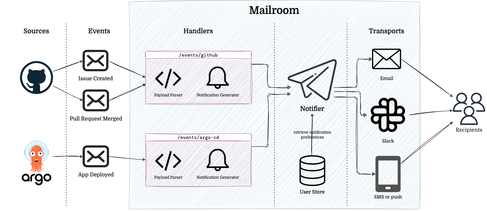

# 

Mailroom is a framework that simplifies the creation, routing, and delivery of user notifications based on events from external systems.

Mailroom is designed to be flexible and extensible, allowing you to easily add new hanlders and transports as your needs grow and evolve. Simply write a function to transform incoming events into notifications, and Mailroom will take care of the rest, including:

- Acting as the primary notification relay for incoming webhooks from external systems
- Sending notifications to the appropriate users based on their preferences (e.g. PR reviews go to email, but build failures go to Slack)
- Formatting notifications for different transports (e.g. email, Slack, etc.)
- Matching usernames, emails, IDs, etc. across different systems
- Logging, error handling, retries, and more

See [`internal/example.go`](./internal/example.go) for an example of how to use mailroom.

## Documentation

- [Getting Started](./docs/getting-started.md)
- [Core Concepts](./docs/core-concepts.md)
- [Advanced Topics](./docs/advanced-topics.md)
- [Integrations](./docs/integrations.md)

Also see the [GoDoc](https://pkg.go.dev/github.com/seatgeek/mailroom) for documentation.

## Contributing

See [CONTRIBUTING.md](./.github/CONTRIBUTING.md) for contribution guidelines.

Use `make` to run all linters and tests locally.
