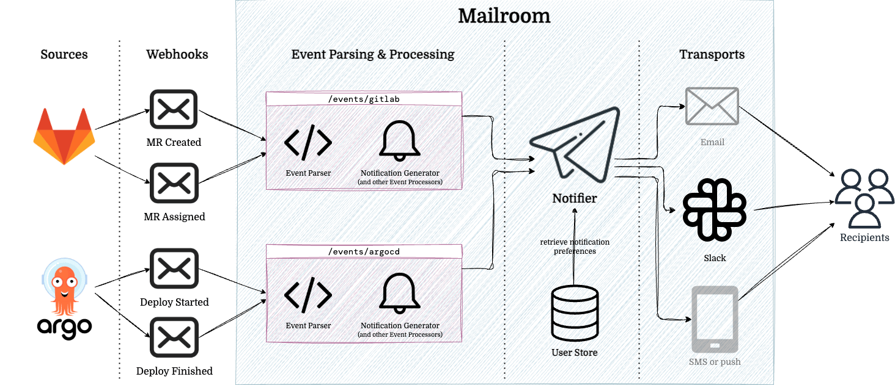

# 

Mailroom is a framework that simplifies the creation, routing, and delivery of user notifications based on events from external systems.

Mailroom is designed to be flexible and extensible, allowing you to easily add new hanlders and transports as your needs grow and evolve. Simply write a function to transform incoming events into notifications, and Mailroom will take care of the rest, including:

- Acting as the primary notification relay for incoming webhooks from external systems
- Sending notifications to the appropriate users based on their preferences (e.g. PR reviews go to email, but build failures go to Slack)
- Formatting notifications for different transports (e.g. email, Slack, etc.)
- Matching usernames, emails, IDs, etc. across different systems
- Logging, error handling, retries, and more

See [`internal/example.go`](./internal/example.go) for an example of how to use mailroom.

## Documentation

See the [GoDoc](https://pkg.go.dev/github.com/seatgeek/mailroom) for documentation.

More detailed documentation is coming soon.

### Terminology

- **Event**: An event is some action that occurs in an external system that we want to send a **notification** for.
- **Notification**: A notification is a string that should be sent to a **user** via some **transport**.
- **Source**: A source is any external system that sends webhook events to Mailroom.
- **Handler:** A handler is a function that processes an incoming HTTP request from a **source** and returns a list of **notifications** to send.
  - A **handler** can optionally be composed of separate **payload parser** and **notification generator** objects:
    - **Payload Parser**: The payload parser is responsible for:
      - Receiving a serialized **event** via an incoming HTTP request
      - Validating the request (e.g. verifying the signature or shared secret)
      - Parsing the raw request body into a useful **event** object if the event is of interest to us
    - **Notification Generator**: The notification generator takes the parsed **event** and generates one or more **notifications** from it
- **Notifier**: A notifier takes the notifications and dispatches them to the appropriate **transports** for delivery based on the **user**'s **preferences**.
- **Transport**: A transport is a way to send a **notification** to a user. It could be email, Slack, Discord, or something else.
- **User**: A user is a person who wants to receive **notifications** from Mailroom and has **preferences** on how they'd like to receive them.
- **Identifier**: An identifier is a unique string that identifies an initiator or potential recipient (**user**) of some event. It could be an email address, a Slack user ID, or something else.
  - It is composed of three parts:
    - **Namespace** (optional): The namespace of the identifier (e.g. `slack.com`, `github.com`)
    - **Kind**: The kind of identifier (e.g. `email`, `username`, `id`)
    - **Value**: The actual value of the identifier (e.g. `rufus@seatgeek.com`, `rufus`, `U123456`)
  - For example, `slack.com/email:rufus@seatgeek.com` means that Slack knows this user by the email address `rufus@seatgeek.com`.
- **Identifier Set**: All known **identifiers** that are associated with a single **user**.
- **Preferences**: Preferences are how users specify which **notifications** they want, and which **transports** they prefer to receive them on.
- **User Store**: The user store is a database that stores user information, including their **identifiers** and **preferences**.

## Contributing

See [CONTRIBUTING.md](./.github/CONTRIBUTING.md) for contribution guidelines.

Use `make` to run all linters and tests locally.
